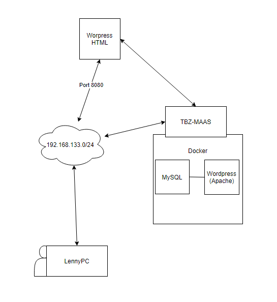

# M300-Services
## LB02
### K1
Ich habe nach Anleitung Virtualbox, Vagrant, Visual Studio Code und Git-Client installiert.

VSCode und Git-Client mit SSH-Paar waren schon vorhanden

### K2
Github Account ist erstellt und Repository mit Herr Calisto geteilt.

Als Markdown-Editor wollte ich zuerst Sublime verwenden, aber es war schwierig die richtigen Add-ons zu finden.

### K3
Ich habe nach Anleitung einen Webserver erstellt und am schluss wieder zerstört.

Hier sind die wichtigsten Befehle:
| Befehl                    | Beschreibung                                                      |
| ------------------------- | ----------------------------------------------------------------- | 
| `vagrant init`            | Initialisiert im aktuellen Verzeichnis eine Vagrant-Umgebung und erstellt, falls nicht vorhanden, ein Vagrantfile |
| `vagrant up`              |  Erzeugt und Konfiguriert eine neue Virtuelle Maschine, basierend auf dem Vagrantfile |
| `vagrant ssh`             | Baut eine SSH-Verbindung zur gewünschten VM auf                   |
| `vagrant status`          | Zeigt den aktuellen Status der VM an                              |
| `vagrant port`            | Zeigt die Weitergeleiteten Ports der VM an                        |
| `vagrant halt`            | Stoppt die laufende Virtuelle Maschine                            |
| `vagrant destroy`         | Stoppt die Virtuelle Maschine und zerstört sie.                   |

### K4


**Firewall-Regeln**
```Shell
    # Port 80 (HTTP) öffnen für alle
    vagrant ssh web
    sudo ufw allow 80/tcp
    exit

    # Port 22 (SSH) nur für den Host (wo die VM laufen) öffnen
    vagrant ssh web
    w
    sudo ufw allow from [Meine-IP] to any port 22
    exit

    # Port 3306 (MySQL) nur für den web Server öffnen
    vagrant ssh database
    sudo ufw allow from [IP der Web-VM] to any port 3306
    exit
```

**Zugriff testen**
```Shell
    $ curl -f 192.168.0.80
    $ curl -f 192.168.55.83:3306
```

**Löschen von Regeln**
```Shell
    $ sudo ufw status numbered
    $ sudo ufw delete 1
```

**Ausgehende Verbindungen** <br>
Ausgehende Verbindungen werden standardmässig erlaubt.

Werden keine Ausgehenden Verbindungen benötigt oder nur bestimmte (z.B. ssh) können zuerst alle geschlossen und dann einzelne Freigeschaltet werden.

```Shell
    $ sudo ufw deny out to any
    $ sudo ufw allow out 22/tcp 
```


## LB3
### K2
**Persönlicher Wissenstand** <br>
Mein Wissenstand ist praktisch nicht vorhanden. Mein Betrieb hat mir vor ca. einem Jahr erklärt was Kubernetes ist und das in Verbindung mit AWS oder von Google. Docker wurde mir auch mehrmals erklärt. Mir ist bewusst, dass man mittels Docker Container erstellen kann, in denen Applikationen, abgeschottet von allem anderen laufen können. Wofür und wieso man das macht ist mir im moment noch nicht bekannt.

### K3
### Befehle
Hier sind die wichtigsten Befehle:
| Befehl                    | Beschreibung                                                      |
| ------------------------- | ----------------------------------------------------------------- | 
| `docker run` | Ist der Befehl zum Starten neuer Container, hat aber auch extrem viele Argumente und ist somit auch kompliziert |
| `docker ps` |  Gibt einen Überblick über die aktuellen Container, wie z.B. Namen, IDs und Status. |
| `docker images` | Gibt eine Liste lokaler Images aus, wobei Informationen zu Repository-Namen, Tag-Namen und Grösse enthalten sind. |
| `docker rm` | Entfernt einen oder mehrere Container. Gibt die Namen oder IDs erfolgreich gelöschter Container zurück.|
| `docker rmi` | Löscht das oder die angegebenen Images. Diese werden durch ihre ID oder Repository- und Tag-Namen spezifiziert. |
| `docker start` | Startet einen (oder mehrere) gestoppte Container |
| `docker stop` | Stoppt einen oder mehrere Container (ohne sie zu entfernen). Nach dem Aufruf von `docker stop` für einen Container wird er in den Status »exited« überführt. |
| `docker kill` | Schickt ein Signal an den Hauptprozess (PID 1) in einem Container. Standardmässig wird SIGKILL gesendet, womit der Container sofort stoppt. |
| `docker logs` | Gibt die "Logs" für einen Container aus. Dabei handelt es sich einfach um alles, was innerhalb des Containers nach STDERR oder STDOUT geschrieben wurde. |
| `docker inspect` | Gibt umfangreiche Informationen zu Containern oder Images aus. Dazu gehören die meisten Konfigurationsoptionen und Netzwerkeinstellungen sowie Volumes-Mappings. |
| `docker diff` | Gibt die Änderungen am Dateisystem des Containers verglichen mit dem Image aus, aus dem er gestartet wurde. |
| `docker top` | Gibt Informationen zu den laufenden Prozessen in einem angegebenen Container aus. |

#### 09.07.20
Anleitung: https://www.ionos.de/community/server-cloud-infrastructure/docker/bereitstellen-von-wordpress-in-docker-containern/
Ich habe mittels der Anleitung probiert Wordpress zu starten (Webapp im Frontend & DB im Backend).
Die Installation war erfolgreich, leider konnte ich es nicht testen, da die Verbindung zur Website refused wird.
Zuletzt hat mir auch Marc probiert zu helfen. Wir haben das Problem mit den VM's auf meinem PC angeschaut aber auch er hat nichts gefunden. Marc war so grosszügig und hat mir einen CentOS server spendiert. Dieser ist auch über eine Public IP erreichbar.

### 10.07.20
Auf dem Public Server konnte Docker nicht anständig installiert werden. Nach einer Weile probieren hat die Installation funktioniert aber `docker run hello-world` gab einen Error aus, dass man keine Berechtigung hat, obwohl man mit dem Root-User eingeloggt ist. Zuletzt hat mir Laura ihre TBZ-VM gegeben. Dort konnte ich endlich Wordpress anständig aufsetzen und K3 weitermachen.

